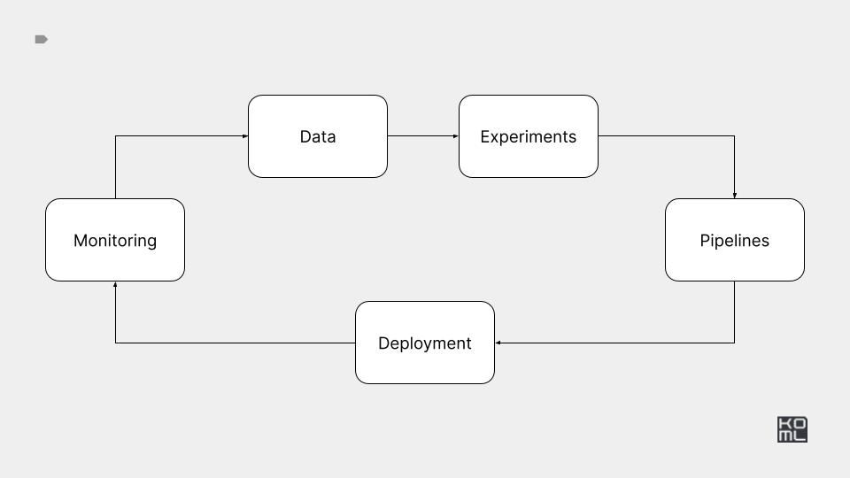

# ml-in-production-getting-started

Welcome to course for learning the details of ML in production. My main project for this course is to create a multi-agent system that can do some asynchronous reachout and networking on like minded redditors and will be recorded elsewhere in an isolated [repo](https://github.com/abemdxb/reddit-network-bot).  Note- this is an purely not for profit project that is meant to showcase skillsets in and around MLOPs, CI/CD, multi-agent systems and other key technologies.

I will be following the course as outlined [here](https://edu.kyrylai.com/courses/ml-in-production) and am writing up my thoughts and questions around the technology here. This is my radical attempt at showcasing my knowledge of key technologies as a technical PM. 

I'll update this markdown file to include a summary as time progresses!

**Update - 2025-03-06**

This is my first update on the progress for the course and I'm catching up after a couple of weeks of illness.  Initial thoughts having gone through the infrastructure, data and experimental portions of the course? It's amazing to learn the "dark matter" that infra-level engineers have to deal with. From CI/CD to infra monitoring and setup, there is a lot under the hood for a 0-1 PM to keep in mind as they start and scale a startup. Setting the foundations right at the get-go is a critical decision and I wonder if this is something PMs can create time for in strategic maps. 

Not really related to the open technical questions and thoughts I've had (you can see those in the module folder markdowns), but I wonder what the relationship is between initial investment in setting infra foundations and hitting PMF with 5-10 enterprises (yes I'm enterprise focused), and the pop-up in the J-curve looks like. I suspect true differentiation and moats comes from good some new tech built to get differentiated performance up front + infra to keep iterating from there quickly in order to maintain the lead.
